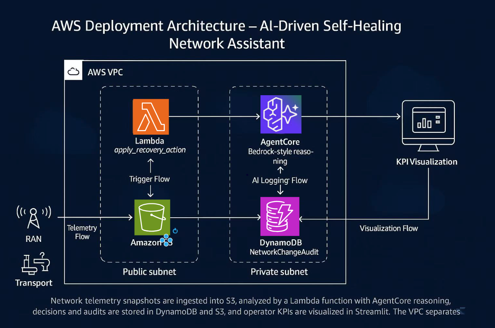

---

### `/README.md`
```md
# AI-Driven Self-Healing Network Assistant
_Developed for the AWS Generative AI Hackathon – Telco Edition (Dublin, 2025)_

---

## 🌍 Overview
This project demonstrates an **AI-driven, autonomous network optimization pipeline** that detects incidents, reasons about root causes, applies recovery actions, and validates performance improvement — all within AWS native services.

The solution showcases a **closed-loop system** across RAN and Transport network layers using **Amazon S3, Lambda, DynamoDB, and Bedrock AgentCore**.

---

## 🧠 Problem Statement
Telecommunication networks generate diverse telemetry from multiple layers and vendors.
However, data is often **inconsistent, fragmented, and hard to unify**, blocking AI-driven operations.

We address this by creating a **Unified Telemetry Layer** – a schema-driven system that normalizes metrics and enables an autonomous “sense → reason → act → verify” loop.

---

## ⚙️ Architecture

**Flow:**  
RAN / Transport → S3 (Unified Schema) → Lambda + AgentCore → DynamoDB + S3 Audit → Streamlit KPI Dashboard



---

## 🧩 Components

| Layer | Description |
|-------|--------------|
| **Data / Telemetry** | `mock_metrics.json` and `before_after_metrics.csv` simulate network health metrics. |
| **Unified Schema** | Defined in `data/schema.md`, standardizing latency, packet loss, throughput, utilization, and energy KPIs. |
| **Lambda Function** | `lambda_s3_handler.py` auto-triggers on new uploads, invokes the reasoning agent, and writes optimized results. |
| **AI Reasoning Layer (AgentCore)** | `agentcore_simulator.py` emulates Bedrock AgentCore logic — root cause analysis and recommendation. |
| **Audit & Visualization** | DynamoDB + S3 `/logs/audit/` store all actions, and KPIs are visualized via Streamlit dashboard. |

---

## 🧮 Sample Data
`data/mock_metrics.json` simulates two network cells:

- **cell-A01 (RAN)** – experiences latency spike → AI applies *traffic steering*
- **cell-B17 (Transport)** – faces congestion → AI applies *load balancing*

---

## 🚀 Demo Workflow
1. Upload `mock_metrics.json` to S3 bucket `self-healing-network-telemetry-demo/data`
2. S3 event triggers Lambda function
3. Lambda calls AgentCore reasoning simulator
4. AI detects anomaly and applies recovery action
5. Results recorded in DynamoDB and S3 audit log

---

## 📊 Impact Summary
| KPI | Before | After | Improvement |
|------|---------|--------|-------------|
| Latency (A01) | 310 ms | 140 ms | ↓ 55% |
| Packet Loss (A01) | 5.8% | 2.2% | ↓ 62% |
| Energy Usage | 3.9 kWh | 3.1 kWh | ↓ 20% |
| AI Confidence | – | 0.84 | – |

---

## 🧪 Demo Video
🎥 [View the 1-minute demo](demo/video_link.txt)  
_“Upload → Detect → Optimize → Audit” in real-time._

---

## 🧰 Tools Used
- **AWS S3** – Unified telemetry storage
- **AWS Lambda** – Self-healing logic & trigger automation
- **AWS DynamoDB** – Audit log persistence
- **AWS Bedrock AgentCore** – AI reasoning layer
- **Streamlit** – KPI visualization dashboard

---

## 📁 Repository Structure

```